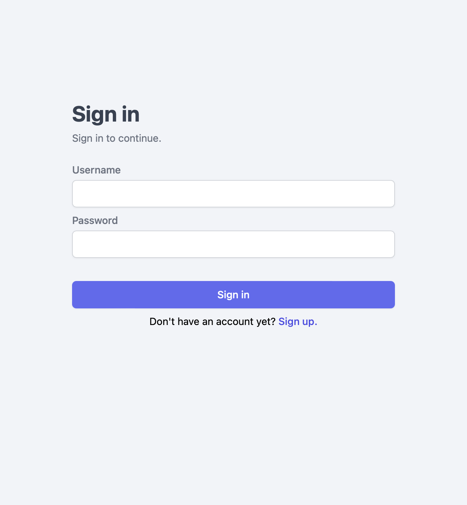
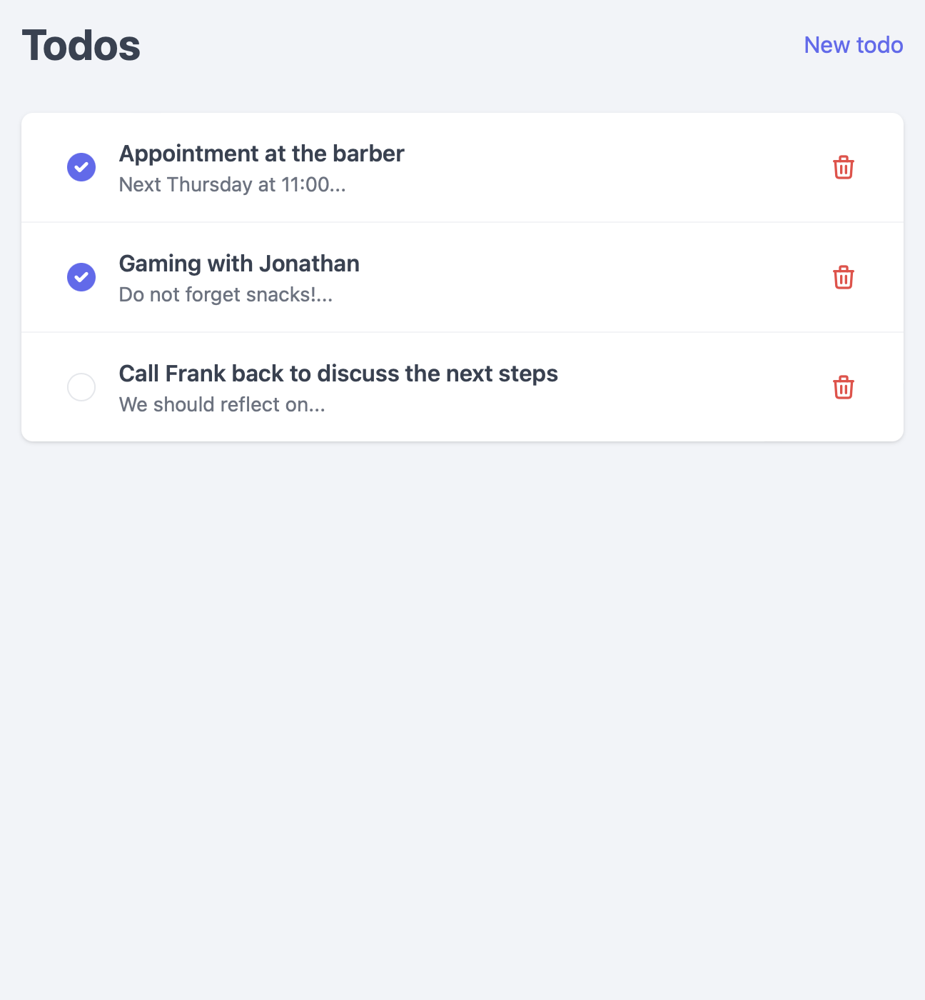
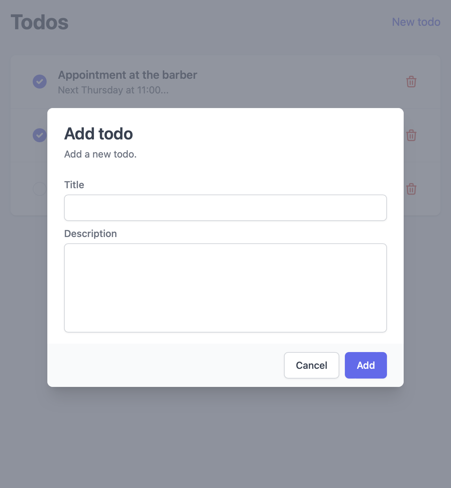
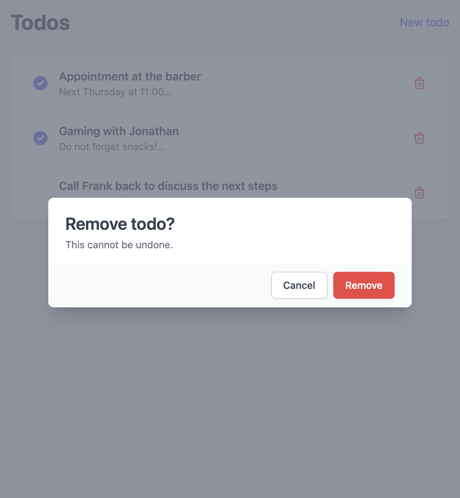

# todo-app

Dockerized full-stack todo application with authentication. Built with React, Express, Postgres, and Nginx.

## Images

## Requirements

- Docker
- Docker Compose

## Installation

1. Clone this repository
2. Navigate to the root directory of the project
3. Run `docker compose up`
4. Open a web browser and navigate to http://localhost:80 http://localhost:3000

## Features

- **User Authentication**: The application implements a custom authentication flow with refresh and access tokens, ensuring the security of user data.
- **CRUD Operations**: The app provides typical CRUD operations (Create, Read, Update, Delete) for managing todo items.
- **React Frontend**: The frontend is built with React as SPA (Single Page Application), providing a modern and efficient development experience. The user interface is designed to be intuitive and easy to use.
- **Express Backend**: The backend is built with Express and uses an ORM (Object-Relational Mapping) for database interaction. This allows for easy and efficient querying. It provides a RESTful API for the frontend to interact with.
- **Postgres Database**: The application uses a Postgres database to store user and todo item information.
- **Nginx Reverse Proxy**: The app uses an Nginx reverse proxy to handle incoming HTTP requests and route them to the appropriate backend service.
- **Docker Containers**: The app is dockerized / containerized for easy development and scalability.
